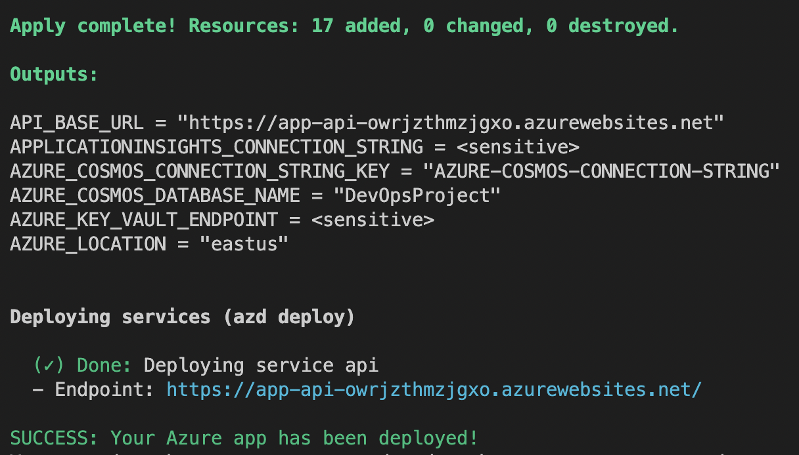

# DevOps Project

A complete DevOps project that includes everything needed to build, deploy, and monitor a simple HTTP service on Azure.

This application uses the Azure Developer CLI (azd) to set up on Azure quickly using Terraform as the IaC provider, Node.js for the API, Azure Cosmos DB API for MongoDB for storage, and Azure Monitor for monitoring and logging.

## Application Architecture

This application utilizes the following Azure resources:

- [**Azure App Services**](https://docs.microsoft.com/azure/app-service/) to host the API backend
- [**Azure Cosmos DB API for MongoDB**](https://docs.microsoft.com/azure/cosmos-db/mongodb/mongodb-introduction) for storage
- [**Azure Monitor**](https://docs.microsoft.com/azure/azure-monitor/) for monitoring and logging
- [**Azure Key Vault**](https://docs.microsoft.com/azure/key-vault/) for securing secrets

Here's a high level architecture diagram that illustrates these components. Notice that these are all contained within a single [resource group](https://docs.microsoft.com/azure/azure-resource-manager/management/manage-resource-groups-portal), that will be created when you create the resources.


### Security

#### Roles

The project creates a [managed identity](https://docs.microsoft.com/azure/active-directory/managed-identities-azure-resources/overview) for the app inside Azure Active Directory tenant, and it is used to authenticate the app with Azure and other services that support Azure AD authentication like Key Vault via access policies. You will see principalId referenced in the infrastructure as code files, that refers to the id of the currently logged in Azure Developer CLI user, which will be granted access policies and permissions to run the application.

#### Key Vault

The project uses [Azure Key Vault](https://docs.microsoft.com/azure/key-vault/general/overview) to securely store Cosmos DB connection string for the provisioned Cosmos DB account.

## Application Code

The repo is structured to follow the [Azure Developer CLI](https://learn.microsoft.com/en-us/azure/developer/azure-developer-cli/make-azd-compatible) conventions including:

- **Source Code**: All application source code is located in the `src` folder.
- **Infrastructure as Code**: All application "infrastructure as code" files are located in the `infra` folder.
- **Azure Developer Configuration**: An `azure.yaml` file located in the root that ties the application source code to the Azure services defined in the "infrastructure as code" files.

### Prerequisites

The following prerequisites are required to run this project.

- [Azure Developer CLI](https://aka.ms/azd-install)
- [Node.js with npm (16.13.1+)](https://nodejs.org/) - for API
- [Terraform CLI](https://aka.ms/azure-dev/terraform-install)

## Spin up resources

To get this application up and running on Azure, use the `azd up` command. This will create and configure all necessary Azure resources - including access policies and roles for your account and service-to-service communication with Managed Identities.

1. Run the following command to initialize the project, provision Azure resources, and deploy the application code.

```bash
azd up
```

You will be prompted for the following information:

- `Environment Name`: This will be used as a prefix for the resource group that will be created to hold all Azure resources. This name should be unique within your Azure subscription.
- `Azure Location`: The Azure location where your resources will be deployed.
- `Azure Subscription`: The Azure Subscription where your resources will be deployed.

> NOTE: This may take a while to complete as it executes three commands: `azd init` (initializes environment), `azd provision` (provisions Azure resources), and `azd deploy` (deploys application code). You will see a progress indicator as it provisions and deploys your application.

When `azd up` is complete it will output the following URLs:

- Azure Portal link to view resources
- API application



## Monitor the application using `azd monitor`

To help with monitoring applications, the Azure Dev CLI provides a `monitor` command to help you get to the various Application Insights dashboards.

- Run the following command to open the "Overview" dashboard:

  ```bash
  azd monitor --overview
  ```

- Live Metrics Dashboard

  Run the following command to open the "Live Metrics" dashboard:

  ```bash
  azd monitor --live
  ```

- Logs Dashboard

  Run the following command to open the "Logs" dashboard:

  ```bash
  azd monitor --logs

## Clean up resources

When you are done, you can delete all the Azure resources created with this template by running the following command:

```bash
azd down
```
